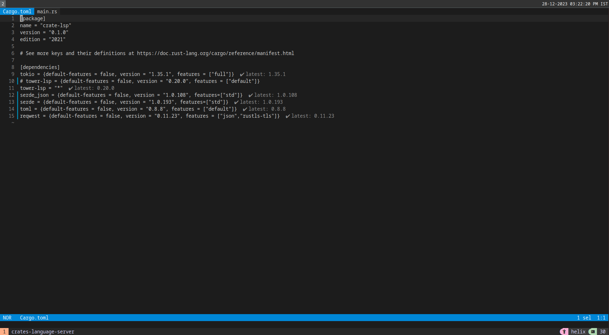

# crates-language-server
Crates Language Server For Helix-Editor

# Steps to build and install
```sh
# build
cargo build --release
# move binary to any dir included in $PATH
sudo cp -v ./target/release/crate-lsp /usr/local/bin
# append content of language.toml to your own languages.toml
cat ./languages.toml >> ~/.config/helix/languages.toml
```


